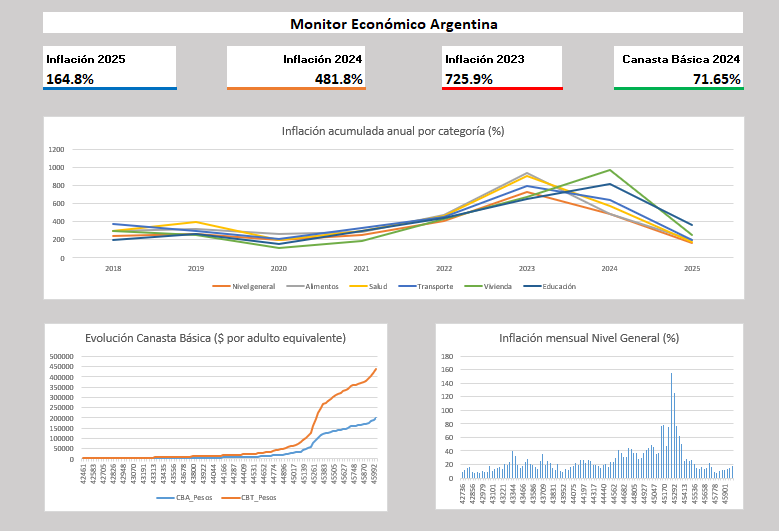

#  Monitor Económico Argentina

Dashboard interactivo de análisis económico con datos reales del INDEC.  
Construido en **Excel** y **Power BI** como proyecto de portafolio para analista de datos.

---

##  Herramientas utilizadas

- **Excel** — Power Query, modelo de datos, SUMAPRODUCTO, tablas dinámicas, dashboard
- **Power BI** — DAX, modelo estrella, segmentador interactivo, 4 tipos de visualizaciones, limpieza y transformación de datos crudos del INDEC

---

##  Fuentes de datos

| Dataset | Fuente | Período |
|---|---|---|
| IPC Nacional por categoría | INDEC | Ene 2017 – Ene 2026 |
| Canasta Básica Alimentaria y Total | INDEC | Abr 2016 – Ene 2026 |

---

##  Estructura del proyecto

```
monitor-economico-argentina/
│
│__ Capturas
│   │__ Dashboard_Excel.png
│   │__ Dashboard_Power_Bi.png
│
│__ Datos_Crudos
│   │__serie_cba_cbt.xls 
│   │__sh_ipc_02_26.xls
│
│__ Datos_Limpios/
│   │__ IPC_Variacion_Mensual.csv
│   │__ Canasta_Basica.csv
│
│__Proceso
│    │__ Datos_Limpios.xlsx
│
│__ Monitor_Economico_Argentina.xlsx
│__ Monitor_Economico_Argentina.pbix
│__ README.md
```

---

##  Metodología

1. **Extracción:** descarga de archivos XLS oficiales del INDEC
2. **Limpieza:** transformación con Excel — unpivot, normalización de fechas, filtrado de categorías
3. **Modelado:** modelo estrella con tabla Calendario como dimensión central
4. **Análisis:** KPIs, variaciones acumuladas, comparación por categoría y período
5. **Visualización:** dashboard en Excel y reporte interactivo en Power BI

---

##  Principales hallazgos

> **2023 fue el año de mayor inflación del período analizado**

-  La inflación acumulada de **2023 fue de 725.9%** — la más alta del período 2017-2026
-  **Vivienda** fue la categoría más inflacionaria en 2024, con **970% acumulado**
-  La **Canasta Básica Total** pasó de $3.663 en abril 2016 a **$440.226 en enero 2026** — un incremento de +11.916%
-  Desde 2022, **ninguna categoría registró inflación anual por debajo del 400%**
-  El pico mensual más alto fue **diciembre 2023 con 25.5%** de variación mensual
-  En 2025 se observa una **desaceleración sostenida**, con inflación acumulada de 164.8% vs 481.8% de 2024

---

##  Dashboard Excel



**Habilidades demostradas:**
- Power Query para limpieza y transformación
- Modelo de datos con relaciones entre 3 tablas
- Fórmulas SUMAPRODUCTO para KPIs dinámicos
- Diseño de dashboard con tarjetas y 3 gráficos

---

##  Reporte Power BI


**Habilidades demostradas:**
- Tabla Calendario con DAX (CALENDAR, YEAR, MONTH, FORMAT)
- Medidas DAX (SUMX, AVERAGE, LASTNONBLANK)
- Modelo estrella con relaciones 1 a muchos
- Segmentador interactivo por año
- 4 tipos de visualizaciones coordinadas

---

##  Cómo usar este proyecto

1. Cloná el repositorio
2. Abrí `Monitor_Economico_Argentina.xlsx` con Excel 2016 o superior
3. Abrí `Monitor_Economico_Argentina.pbix` con Power BI Desktop
4. Usá el segmentador de años para explorar cada período

---

##  Autor

**Braian Cano**  
Analista de Datos | Excel · Power BI · SQL  
 La Rioja, Argentina  

[](https://linkedin.com/in/braian-cano-97846929a)
[](https://github.com/BraianCano?tab=overview&from=2026-03-01&to=2026-03-11)

---

